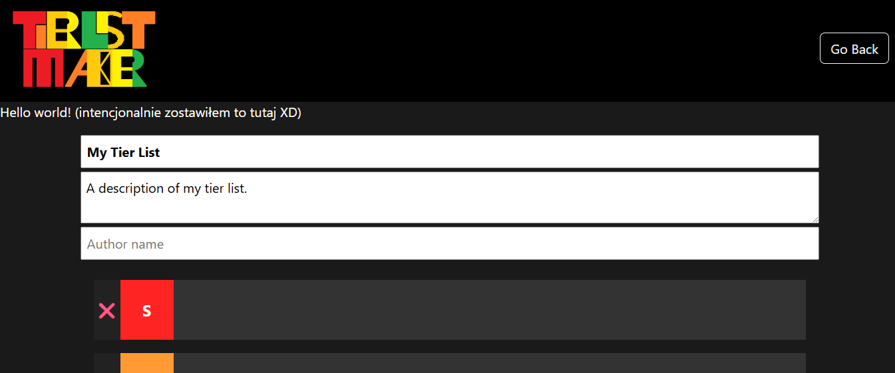

# Tier List Maker 🏆📊


A full-stack web application designed for creating, customizing, and sharing tier lists. The project features a drag-and-drop interface, image manipulation tools, and a persistent backend for saving user creations.

## 🚀 Features

* **Interactive Tier Creator:**
    * **Drag & Drop:** Smooth item placement using `react-dnd`.
    * **Customization:** Add new rows, change colors, and rename tiers dynamically.
    * **Image Upload & Crop:** Built-in tool (`react-easy-crop`) to upload and precisely crop images for tier items.
* **Snapshot Generation:** Automatically generates and saves a screenshot of the finished tier list using `html2canvas`.
* **Gallery Mode:** Browse a list of all created tier lists with their generated snapshots.
* **Robust Backend:**
    * **SQLite Database:** Lightweight and serverless storage for tier list metadata.
    * **File Storage:** Efficient handling of uploaded assets and generated snapshots via `multer`.

## 📸 Screenshots

| Create Tier List | Crop Images |
| :---: | :---: |
|  |  |

| Main Dashboard | Completed List |
| :---: | :---: |
|  |  |

## 🛠️ Tech Stack

### Frontend
* **Framework:** React (Create React App)
* **State & Routing:** React Router DOM
* **Drag & Drop:** React DnD
* **Utilities:** Html2Canvas, React Easy Crop, Lucide React (Icons)

### Backend
* **Runtime:** Node.js
* **Framework:** Express.js
* **Database:** SQLite3
* **Middleware:** CORS, Multer (for file uploads)

## 📥 Getting Started

The project is divided into two parts: `frontend` and `backend`. Both need to be running simultaneously.

### Prerequisites
* Node.js (v16 or higher)
* npm

### 1. Backend Setup

Navigate to the backend directory and install dependencies:

```bash
cd backend
npm install
```

Start the server (runs on port 2137 by default):
```
node server.js
```
Note: The server will automatically create the tierlists.db database and an uploads/ folder upon the first run.

### 2. Frontend Setup
Open a new terminal, navigate to the frontend directory, and install dependencies:

```
cd frontend
npm install
```

Start the React development server:
```
npm start
```
The application will launch at http://localhost:3000.

# 📡 API Reference
The backend exposes the following REST endpoints:
```
GET /api/tierlists - Retrieve all saved tier lists.

GET /api/tierlists/:id - Retrieve details of a specific tier list.

POST /api/tierlists - Save a new tier list (accepts multipart/form-data with title, author, description, and snapshotImage).
```
# 📂 Project Structure
```bash
Tier-List-Maker/
├── backend/
│   ├── uploads/         # Stored images and snapshots
│   ├── server.js        # Express application entry point
│   └── tierlists.db     # SQLite database file
├── frontend/
│   ├── src/
│   │   ├── components/  # Reusable UI components
│   │   ├── pages/       # CreatorPage, MainPage, ViewerPage
│   │   └── App.js       # Main routing logic
│   └── public/
└── Screenshots/         # Preview images for documentation
```
# 📄 License
This project is open-source and available for educational purposes.
